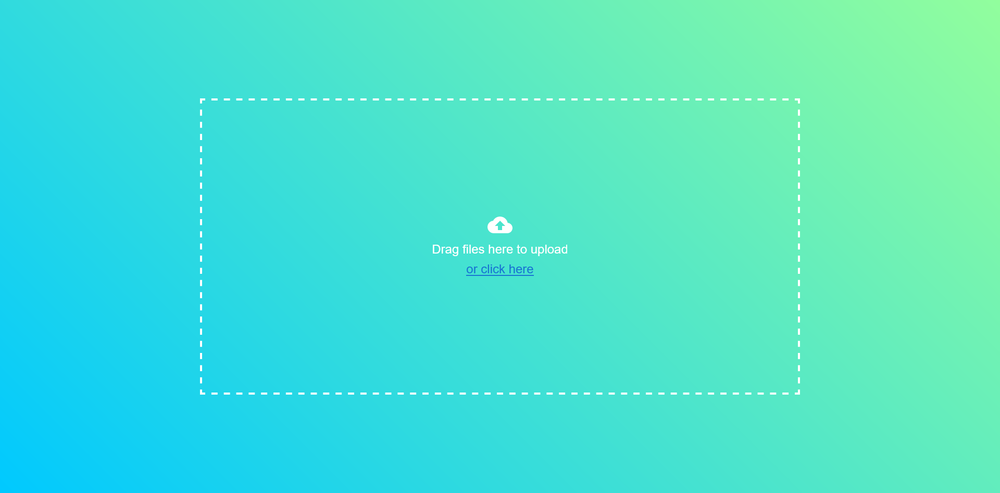

# CloudDrop



CloudDrop creates a simple API server to quickly upload files from anywhere, either by the lightweight webpage, or directly via the API call.
This allows you to upload from any device, or as part of any recon scripts that you may use when pen-testing.

## Features

- Upload any file type up to 1GB
- Enable auth to stop any person uploading
- Restrict file types that can be uploaded
- Front-end website
- Accessible API to be used anywhere
- Configurable via env

## Setting Up

*TODO: Show docker setup command once uploaded to docker, configure github options*

## How to use

### Web

Navigate to `http://{yoursitehere.com}`. Simply drag and drop your files to upload.

### API

The file can be sent via curl, if auth is enabled, you can attach the basic authorization header (concatenated username, :, password and encoded using base64)

```bash
curl http://{yoursitehere.com} \
-d @path/to/data \
-H "Authorization: Basic {username:password}
```

### SFTP

*Coming soon*

## Development

### `npm start`

Runs the app in the development mode. 
Open [http://localhost:3000](http://localhost:3000) to view it in your browser.

### `npm run build`

Builds the app for production to the `build` folder.\
It correctly bundles React in production mode and optimizes the build for the best performance.

### Deployment

This section has moved here: [https://facebook.github.io/create-react-app/docs/deployment](https://facebook.github.io/create-react-app/docs/deployment)